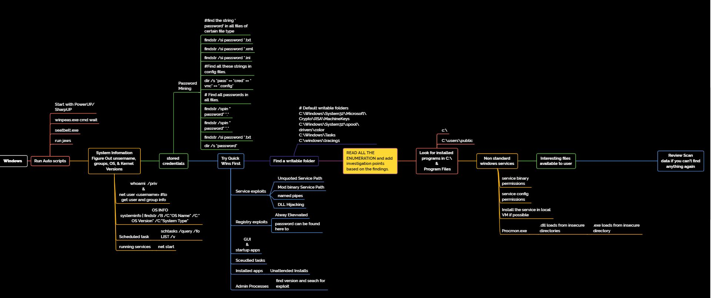

### Mind Maps





### System Enumeration For Escalation

[linpeas](https://github.com/peass-ng/PEASS-ng/releases)

[linEnum](https://github.com/rebootuser/LinEnum/blob/master/LinEnum.sh)


```
linpeas.sh | tee -a linpeas.log
linenum.sh | tee -a linEnum.log
```


Standalone Binaries Windows

https://lolbas-project.github.io/
