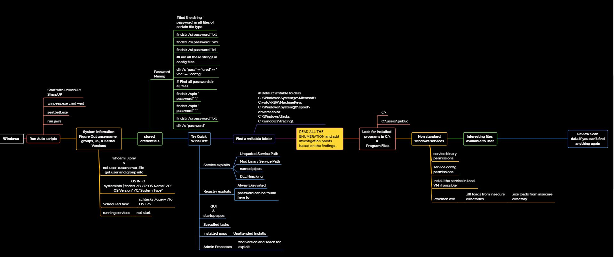

### Mind Maps

### Regex quick stuff

grep for at least 5 character strings

```

```
### SUID Files

```
find / -myuser root -perm -4000 — exec ls -ldb {} \; 2>/dev/null
```

```
find / -user root -perm -4000 — exec ls -ldb {} \;
```

### System Enumeration For Escalation

[linpeas](https://github.com/peass-ng/PEASS-ng/releases/download/20241011-f83883c6/linpeas.sh)
[LinEnum](https://raw.githubusercontent.com/rebootuser/LinEnum/refs/heads/master/LinEnum.sh)
[linpeas_small](https://github.com/peass-ng/PEASS-ng/releases/download/20241011-f83883c6/linpeas_small.sh)

[basic windows recon]("https://raw.githubusercontent.com/frizb/Windows-Privilege-Escalation/refs/heads/master/windows_recon.bat")
[winpeas](https://github.com/peass-ng/PEASS-ng/releases/download/20241011-f83883c6/winPEAS.bat)
[PowerView](https://raw.githubusercontent.com/PowerShellMafia/PowerSploit/refs/heads/dev/Recon/PowerView.ps1)
[PowerUp](https://raw.githubusercontent.com/PowerShellMafia/PowerSploit/refs/heads/dev/Privesc/PowerUp.ps1)


```
linpeas.sh | tee -a linpeas.log
linenum.sh | tee -a linEnum.log
```

### Standalone Binaries Windows

https://lolbas-project.github.io/

### Windows Post-Exploitation Tools

[Sharpsploit](https://github.com/cobbr/SharpSploit)
[Powersploit](https://github.com/PowerShellMafia/PowerSploit)
[mimikatz](https://github.com/gentilkiwi/mimikatz)

**Scripts**



