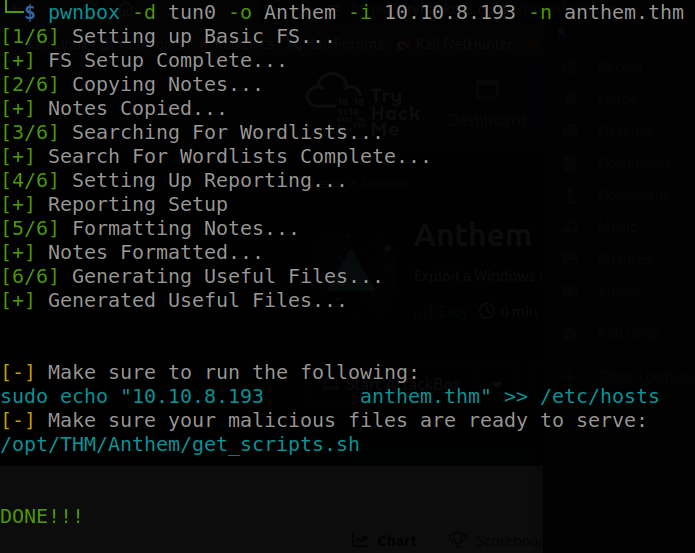
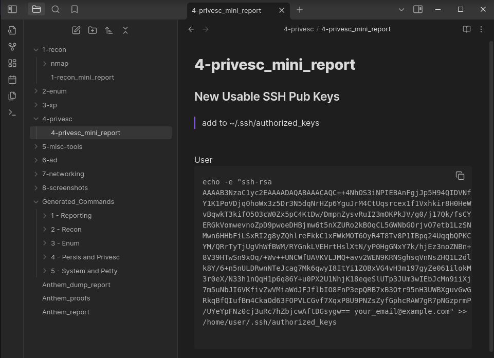

# PWNBOX

***TLDR:*** [PWNBOX](#pwnbox) was created to automate the highly repetitive tasks for CTFs and pentesting alike. Specifically creating a structured evnironment for effective notetaking and synthesising commands for tools commonly used during CTFs. *This entire project is based on my preference for notetaking and the reporting process for CTFs and pentesting.*

How many times have you typed

```
mkdir nmap
``` 

then started to type

```
nmap -v...
```

???

## Usage

```
pwnbox.sh -d DEVICE -n NAME -i IP -n HOSTNAME
```

* The DEVICE is your network interface used to interact with the target box over the network 
* NAME is just the output folder
* IP is the target box ip
* HOSTNAME is the target box hostname





**Example Usages:**

```
❯ pwnbox -d eth0 -n BoxImmaPwn -i 192.168.0.13 -n boxname.local
```

```
❯ pwnbox -d tun0 -n CTFBoxImmaPwn -i 10.10.8.194 -n boxname.thm
```

I use obsidian for notetaking. After I run pwnbox, I just open the folder that pwnbox creates from the *-n* argument as the vault folder for obsidian.

## Requirements

one-liner setup

```
sudo apt install -y texlive-latex-recommended texlive-fonts-extra texlive-latex-extra pandoc p7zip-full docker.io; sudo groupadd docker; sudo usermod -aG docker $USER; sudo systemctl start docker; sudo systemctl enable docker; newgrp docker
```

reporting requirements as seen in [reporting](#reporting) and [noraj's repo](https://github.com/noraj/OSCP-Exam-Report-Template-Markdown#requirements)

- [Pandoc](https://pandoc.org/installing.html)
- LaTeX (eg. [TeX Live](http://www.tug.org/texlive/)) in order to get `pdflatex` or `xelatex`
- [Eisvogel Pandoc LaTeX PDF Template](https://github.com/Wandmalfarbe/pandoc-latex-template#installation)
- [p7zip](http://p7zip.sourceforge.net/) (if you want to use the script, for generating the archive)

```
sudo apt install -y texlive-latex-recommended texlive-fonts-extra texlive-latex-extra pandoc p7zip-full
```

docker setup

```
sudo apt -y install docker.io
sudo groupadd docker
sudo usermod -aG docker $USER
sudo systemctl start docker
sudo systemctl enable docker
newgrp docker
```

docker one-liner setup

```
sudo apt install -y docker.io docker-compose; sudo groupadd docker; sudo usermod -aG docker $USER; sudo systemctl start docker; sudo systemctl enable docker; newgrp docker
```


## Setup FS

```
TLDR: Its just personal preference feel free to skip
```

I like my notes organized in a manner that replicates the pen testing process:

1. Step one - Reconnaissance
2. Step two - Enumeration
3. Exploitation
4. Persistence
5. Privilege Escalation
6. Reporting

Hence creating a folder for every step of the process. Then ***PWNBOX*** aims to dive deeper and create subfolders for various tools, services, and attributes of each step of this proccess. 

Following exposure to industry-level cybersecurity certificaions I realized how demanding the reporting process really can be and how professional and organized one must be to generate a good report. The demand to be organized is even greater to generate a professional report in a timely manner.

I am not a very organized person when it comes to taking notes. A blank report file "miniature report" is generated in every subfolder (aptly named after a pentesting subprocess) so I can keep track of all information relative to that subprocess, but I don't have to worry about making it a polished report just yet. At the same time I don't just have data thrown everywhere in my file system; I know where to go to reference it later.

## Copy Notes

Simply copies notes accrued from previous CTFs to the current one. These notes will be deleted with [helpful scripts](#helpful-scripts) so that they don't take up space on a system repetitively.

## Wordlists, Imp, PayloadsAllThings, GTFObins, LOLBAS

Searches your system for where you installed [SecLists](https://github.com/danielmiessler/SecLists.git) and [Impacket](https://github.com/SecureAuthCorp/impacket.git) for a reference point when formatting notes. This feature is admittedly very rough around the edges.

The markdown syntax from PayloadsAllThings, GTFObins, LOLBAS is leveraged to allow search functionality from Obsidian to empower users to search for possible answers to their immidiate questions. Rather than searching the web, users can have a local copy of infomation used in regular ctf scenarios.

> When first running pwnbox, the script might automatically download these github repositories and will record their locations in the user's .bashrc and/or .zshrc. To run pwnbox again effectively, a new terminal will need to be opened or the config files sourced so the script does not confuse the locations of the repositories on the system. 

## Reporting

Quick Reference: [noraj's repo](https://github.com/noraj/OSCP-Exam-Report-Template-Markdown)

**Generating A Report**

I aggregate all my mini reports into *box_dump_report.md* where I can more effectively lay out my notes chronologically. Once my "report dump" is complete, I can write a more polished report by editing the generated *box_name_report.md* file. Then I can simply run the following to generate a pdf version:

```
./report_gen.sh
```

## Format Notes

This is a function that uses alot of *SED* commands to find various strings throughout the markdown notes and replaces them with variables currently running in the pwnbox script. This way commands that were once useful for pwning one box are now tuned to fit the box you are currently pwning. 

## Useful Files

Creates some files that are handy to have. For example a brand new ssh key to add to authorized_keys on a target system. SO much nicer than typing a password every time.

## Helpful Scripts 

Just scripts to help manage all the files

**change_box_info.sh**

Your target box timed out? The IP changed on you? but you just generated all those commands tuned specifically to that one system!!! Yeah just change the old IP to a new one. This script also can change the hostname and if you want to use a different network interface.

**cleanup.sh**

Removes files that bloat your system. Like hydra.restore and the files obsidian leaves behind for git to pick up.

**get_scripts.sh**

This script is not copied to every target box. The script sets up a directory "quickserv" (outside of the one pwnbox creates) that you can quickly *cd* to, spin up a file sharing service, and download/upload some common tools to a target box without needing to do [things like this](https://www.google.com/search?q=linpeas.sh) 

**report_gen.sh**

covered in [Reporting](#reporting)

**sensitive_scan.sh**

Aims to scan all files for content that github would deem sensitive to upload. Then remove that content from files and place it into  *./sensitive.md* for the user to review.